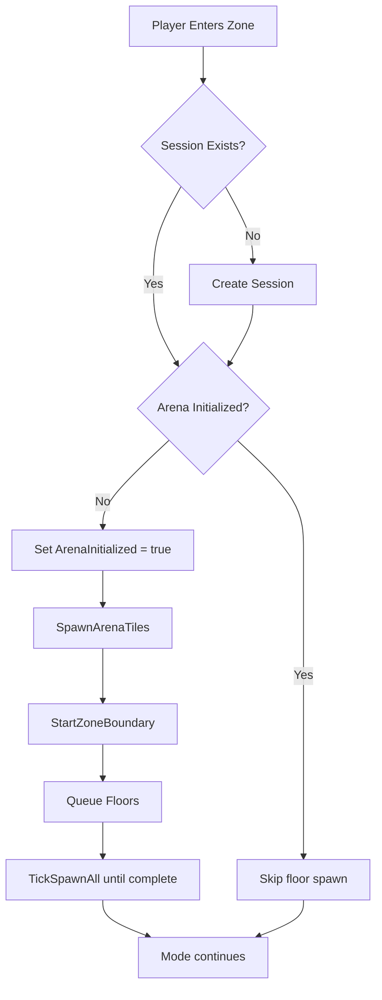

# BattleLuck Build Status

## Current State

Latest validated Release build status (April 15, 2026):

- Status: success
- Output: `bin/Release/net6.0/BattleLuck.dll`
- Errors: 0
- Warnings: 3

## Typical Warnings

- `NU1507` (x2): multiple NuGet package sources without source mapping
- `CS8602` (x1): possible null dereference in `SessionController.cs:361`

## Build Command

```powershell
dotnet build "c:\Users\aa\OneDrive\Desktop\BattleLuck\BattleLuck.sln" -c Release
```

## Notes

- Build duration in this run: ~2.55s
- AI sidecar build/runtime is separate from the C# mod build.

## Floor Spawn Flow



### Top View (Concept)

```text
  F F F F F F
  F F F F F F
  F F C F F F
  F F F F F F
  F F F F F F

F = floor fill tiles
C = zone/platform center
```

### Behavior Summary

- Floors are initialized once per session, on first player entry.
- Later players entering the same active session do not respawn floors.
- Floors are despawned when the session ends.
